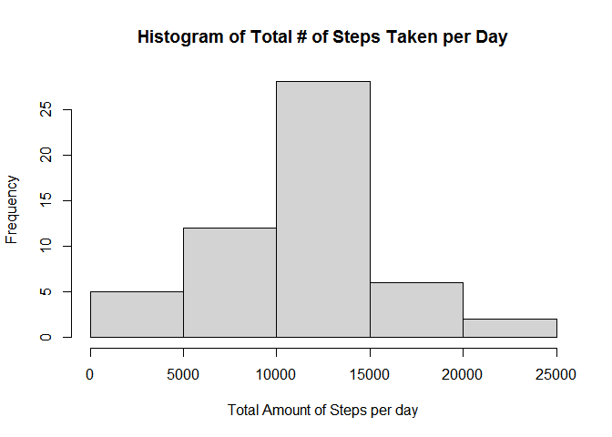
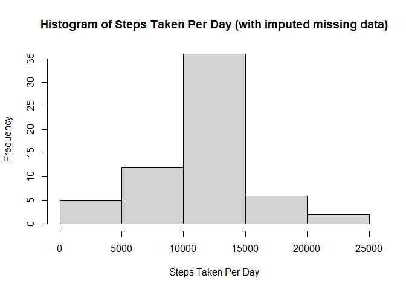
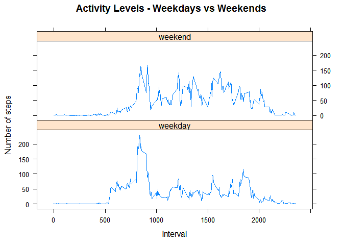

## Loading and preprocessing the data

Below is the code chunk that I used to initialize my data.

```r
#I like to put all of the R code/files into the R folder for easy use
if(!dir.exists("C:/Users/Myself/Documents/R/"))
  dir.create("R")

#This checks to see if the directory where the zip file is unloaded will be
if(!dir.exists("C:/Users/Myself/Documents/R/RepData_PeerAssessment1")){
  temp <- tempfile()
  print("House directory doesn't exist. Creating it now.")
  download.file("https://d396qusza40orc.cloudfront.net/repdata%2Fdata%2Factivity.zip",temp)
  unzip(temp,exdir="./RepData_PeerAssessment1")
}

#Since the file is in the repdata_data_activity folder, I change the directory to reflect the change
setwd("~/R/RepData_PeerAssessment1/repdata_data_activity")

#Reading in the CSV
activityData <- read.csv("activity.csv",header=TRUE,na.strings = "NA")
```

## What is mean total number of steps taken per day?
First, we need to know how many steps are taken per day. Below is a table that illustrates this information.

```r
totalPerDay <- aggregate(steps ~ date,activityData,sum)
head(totalPerDay)
```

```
##         date steps
## 1 2012-10-02   126
## 2 2012-10-03 11352
## 3 2012-10-04 12116
## 4 2012-10-05 13294
## 5 2012-10-06 15420
## 6 2012-10-07 11015
```

Below is that same data in a histogram format.

```r
hist(totalPerDay$steps, xlab="Total Amount of Steps per day", 
       main="Histogram of Total # of Steps Taken per Day")
```

<!-- -->

A quick summary of the data results is below

```r
summary(totalPerDay)
```

```
##      date               steps      
##  Length:53          Min.   :   41  
##  Class :character   1st Qu.: 8841  
##  Mode  :character   Median :10765  
##                     Mean   :10766  
##                     3rd Qu.:13294  
##                     Max.   :21194
```

## What is the average daily activity pattern?
Next, we make a time series plot of the 5-minute interval on the "x-axis" and the average number of steps taken, averaged across all days on the "y-axis".


```r
stepsInterval <- aggregate(steps~interval,activityData,mean)
plot(stepsInterval$steps, type="l", xlab="5 minute interval", ylab="Average amount of steps", 
     main="Amount of Steps Taken per 5-Min Intervals")
```

<!-- -->

One area of interest that comes into mind is which interval has the max. amount of steps across the days. Below is the code used to determine this


```r
maxStepInterval <- which.max(stepsInterval[, 2])
intervalNum <- stepsInterval[, 1][maxStepInterval]
```
The interval with the most steps is 835.

## Imputing missing values
The dataset has missing values, but how many? Below is the code to figure that out.

```r
sumNA<- sum(is.na(activityData$steps))
```

2304! That's a lot of NAs. Why is this? Well, based on the data source, the NAs can indicate times where little movement happened or when the device failed to notice movement. To make this easy, let's just add the average time we
found earlier.

```r
#First, let's make a copy of the data
activityData2 <- activityData

#Calculate the mean over the given intervals
intervalMeans <- by(activityData$steps, activityData2$interval, mean, na.rm=TRUE)

#Then match up the interval to replace the NAs
activityData2[!complete.cases(activityData2), 1] <- 
  intervalMeans[as.character(activityData2[!complete.cases(activityData2), 3])]
```

Now let's redo some of those earlier calculations but on this new data set that doesn't contain any missing data.
First we'll sum the number of steps by day:

```r
sumNAtable <- aggregate(steps~date, activityData2, sum)
```

Then we'll produce a histogram of this information.

```r
hist(sumNAtable$steps, xlab="Steps Taken Per Day", main="Histogram of Steps Taken Per Day (with imputed missing data)")
```

<!-- -->

## Are there differences in activity patterns between weekdays and weekends?
In order to see the difference in patterns, there are multiple parts you need to do.

```r
#First, you need to make a vector of the date field in activityData2
days <- weekdays(as.Date(activityData2$date))

#Then, you make the weekends vector which is a subset of the days
weekends <- days == "Saturday" | days == "Sunday"

#Then you transform the vector into weekend/weekdays
days[weekends] <- "weekend"
days[!weekends] <- "weekday"

# Finally, I added a factor variable to the data set with this information:
activityData2$dayType <- factor(days)
```

To see the difference, a panel plot is advised. This is created by calculating the mean number of steps by type of day (i.e., "weekday" or "weekend") by step interval:

```r
aggMeans <- aggregate(activityData2$steps, by=list(activityData2$interval,activityData2$dayType), mean)
colnames(aggMeans) <- c("interval", "dayType", "steps")

#Next, we create the plot
library(lattice)
xyplot(aggMeans$steps ~ aggMeans$interval | aggMeans$dayType, type = "l", layout = c(1, 2), 
       main = "Activity Levels - Weekdays vs Weekends", xlab = "Interval", ylab = "Number of steps")
```

<!-- -->
